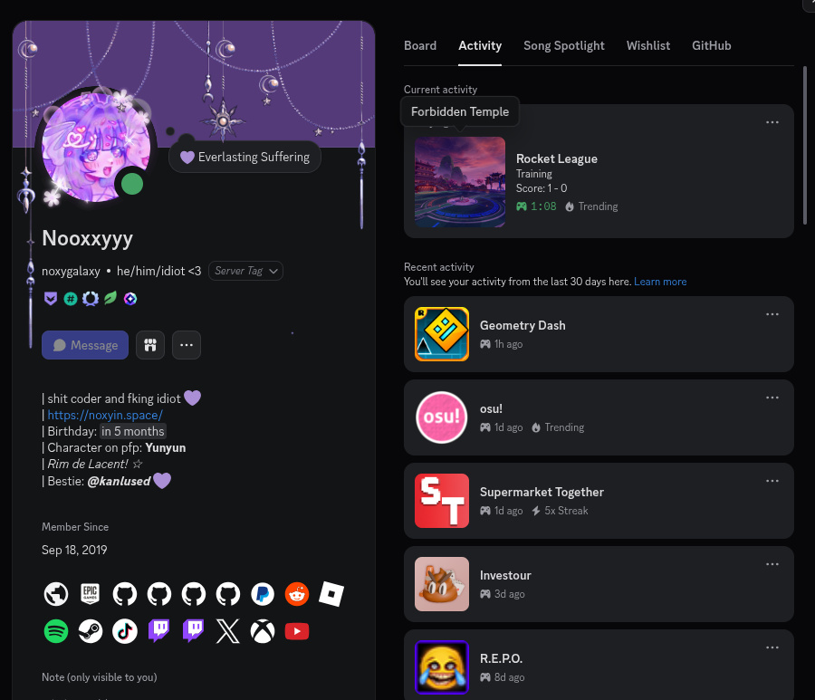

<div align="center">
  <h1>Rocket League Discord RPC</h1>
  <p>EAC-safe Discord Rich Presence for Rocket League. Built on Psyonix's
official Stats API - no BakkesMod, no process injection, works fine
alongside Easy Anti-Cheat. Shows playlist, live score, map thumbnail, and
a best-effort rank badge via Tracker Network. Could be auto-launched with Rocket
League through Heroic.</p>
  
</div>

## Install

### Linux

```bash
curl -fsSL https://raw.githubusercontent.com/noxygalaxy/rl-discord-rpc/main/install.sh | bash
```

### Windows

```powershell
irm https://raw.githubusercontent.com/noxygalaxy/rl-discord-rpc/main/install.ps1 | iex
```

Both scripts pull the latest release, install the binaries, and walk you
through a config prompt (Tracker Network username/platform) on first run.
Run them again anytime for a menu:

```bash
./install.sh  # Linux
.\install.ps1 # Windows
```

Options: **Install/Update**, **Configure**, **Uninstall**.

## Where things live

**Linux**
```
~/.local/share/rl-discord-rpc/rl_discord_rpc # real binary
~/.local/share/rl-discord-rpc/rl_rpc_wrapper # real binary
~/.local/share/rl-discord-rpc/config.json # config
~/.local/bin/rl_discord_rpc # symlink (for PATH)
~/.local/bin/rl_rpc_wrapper # symlink (for Heroic)
```

**Windows**
```
%LOCALAPPDATA%\rl-discord-rpc\rl_discord_rpc.exe # real binary
%LOCALAPPDATA%\rl-discord-rpc\rl_rpc_wrapper.exe # real binary
%LOCALAPPDATA%\rl-discord-rpc\config.json # config
```

## config.json

```json
{
  "discord_client_id": "1540801470503329932",
  "tracker_platform": "epic",
  "tracker_username": "YourEpicUsername",
  "stats_api_port": 49123
}
```

- `discord_client_id` - shared across all installs, no setup needed. Only
  change this if you're running your own Discord Application.
- `tracker_platform` / `tracker_username` - your Tracker Network identity,
  used for the rank badge (`epic`, `steam`, `psn`, or `xbl`).
- `stats_api_port` - must match `Port=` in Rocket League's `TAStatsAPI.ini`.
  Defaults to `49123`.

Edit it with `./install.sh configure` / `.\install.ps1 -Action configure`,
or by hand - no rebuild needed either way, just restart the app.

## Enable Rocket League's Stats API (If you said no during the installation and want to do this manually)

Find `TAGame/Config/TAStatsAPI.ini` (or `DefaultStatsAPI.ini` if it hasn't
been generated yet) and set:

```ini
[TAGame.MatchStatsExporter_TA]
Port=49123
WebPort=49124
PacketSendRate=30
```

`PacketSendRate=0` disables the exporter entirely - this is the most common
cause of a connection-refused error. Quit Rocket League fully before
editing, then relaunch. `rl_discord_rpc` will also try to auto-fix this
value on connect if it detects it's disabled.

## Heroic setup

Rocket League -> Settings -> Advanced -> **Wrapper command**:

- Linux: `~/.local/bin/rl_rpc_wrapper`
- Windows: `%LOCALAPPDATA%\rl-discord-rpc\rl_rpc_wrapper.exe`

Leave the arguments field empty - Heroic appends the real launch command
automatically.

## Building from source

```bash
git clone https://github.com/noxygalaxy/rl-discord-rpc
cd rl-discord-rpc
cargo build --release
```

Binaries land in `target/release/`. Drop a `config.json` next to them
(see above) before running.

## Cutting a release

```bash
git tag v0.1.0
git push origin v0.1.0
```

`release.yml` builds Linux + Windows, bundles each with a starter
`config.json`, and publishes both archives to the GitHub release.

## Contributors

If you would like to help with this project, i would appreciate it! Since it's fully been written from zero by me alone <3s